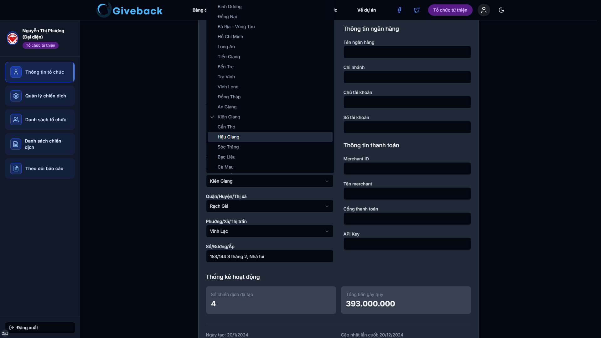

# Vietnam Administrative Tree Optimization

## !Demo

### Mô tả dự án
Dự án này nhằm tối ưu hóa dữ liệu cây hành chính Việt Nam để sử dụng trong việc xây dựng API cung cấp lựa chọn địa chỉ. Dữ liệu ban đầu chứa nhiều cấp hành chính và thông tin dư thừa, gây khó khăn trong việc xử lý và truy xuất. Bằng cách tối giản hóa cây hành chính xuống còn 3 cấp chính, dự án giúp cải thiện hiệu suất và dễ dàng quản lý dữ liệu.

### Cấu trúc thư mục
- `optimize.py`: Script Python dùng để tối ưu hóa cây hành chính.
- `tree.json`: Dữ liệu ban đầu với đầy đủ các cấp hành chính.
- `simplified_tree.json`: Kết quả sau khi tối ưu hóa dữ liệu cây hành chính.
- `demo.png`: Hình ảnh demo kết quả tối ưu.

### Tối ưu hóa dữ liệu
#### Mục tiêu
- Giữ lại 3 cấp hành chính chính: Tỉnh/Thành phố, Quận/Huyện, Phường/Xã.
- Loại bỏ các phần thông tin thừa không cần thiết để giảm kích thước và cải thiện hiệu suất.

#### Quy trình tối ưu
1. **Đọc dữ liệu gốc**: Sử dụng `tree.json` làm nguồn dữ liệu ban đầu chứa đầy đủ thông tin về các cấp hành chính.
2. **Xử lý dữ liệu**: Sử dụng script Python `optimize.py` để duyệt qua từng tỉnh/thành phố, quận/huyện và phường/xã, chỉ giữ lại các thông tin cần thiết.
3. **Ghi dữ liệu đã tối ưu**: Lưu kết quả vào `simplified_tree.json`, đảm bảo dữ liệu được định dạng rõ ràng và dễ sử dụng cho API.

### Chạy script tối ưu hóa
Đảm bảo bạn đã cài đặt Python trên máy tính. Sau đó, chạy lệnh sau trong terminal:

Script sẽ đọc dữ liệu từ `tree.json`, xử lý và lưu kết quả vào `simplified_tree.json`.

### Sử dụng API
API được xây dựng dựa trên dữ liệu tối ưu hóa, giúp bạn dễ dàng tích hợp lựa chọn địa chỉ vào ứng dụng của mình. Cấu trúc dữ liệu đã được giản lược lên 3 cấp chính, phù hợp với hầu hết các nhu cầu sử dụng địa chỉ.

### Liên kết dự án
Repository GitHub:
- https://github.com/CaoQuocViet/vietnam-administrative-tree

Hình ảnh demo:

### Cảm ơn
Cảm ơn bạn đã sử dụng dự án này! Nếu có bất kỳ góp ý hoặc yêu cầu nào, vui lòng liên hệ qua trang GitHub.

### License
Dự án này được phát hành dưới MIT License.

### Liên hệ
Người tạo: Cao Quốc Việt  
Email: vietcao10@gmail.com 

### Tham khảo
- GitHub - CaoQuocViet/vietnam-administrative-tree

### Hỗ trợ
Nếu bạn gặp bất kỳ vấn đề nào khi sử dụng dự án, vui lòng mở issue trên repository GitHub để được hỗ trợ.
